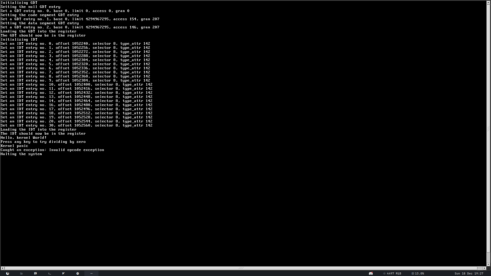

# meaty-skeleton

this is a proof of concept fork of osdev's meaty-skeleton, in process of being transformed into a real operating system  

this OS is not supposed to show my skills of programming nor my knowledge of how computers work and whatnot. this OS is a PoC showing (with proof) the capability of Artificial Intelligence when writing code. so far about 25% of code was written by ChatGPT, most of it worked first try which is pretty insane. what I'm trying to prove is that AI will soon replace either programmers or the knowledge base of programmers. this project is an example of using AI's skills instead of your own (assuming you have any).

## screenshots or something  

  

## roadmap
- [x] boot kernel from grub
- [x] kernel
- [x] io operations
- [x] printing functions
- [x] remapping the pic
- [x] basic keyboard handling
- [x] libc (not full obviously)
- [x] math library
- [x] gdt
- [x] idt
- [x] isr
- [ ] pit
- [ ] irq
- [x] framebuffer
- [x] basic graphics functions
- [ ] multithreading
- [ ] higher half kernel
- [ ] rings
- [ ] permissions
- [ ] paging
- [ ] memory map
- [ ] memory manager
- [ ] memory allocator
- [ ] heap allocator
